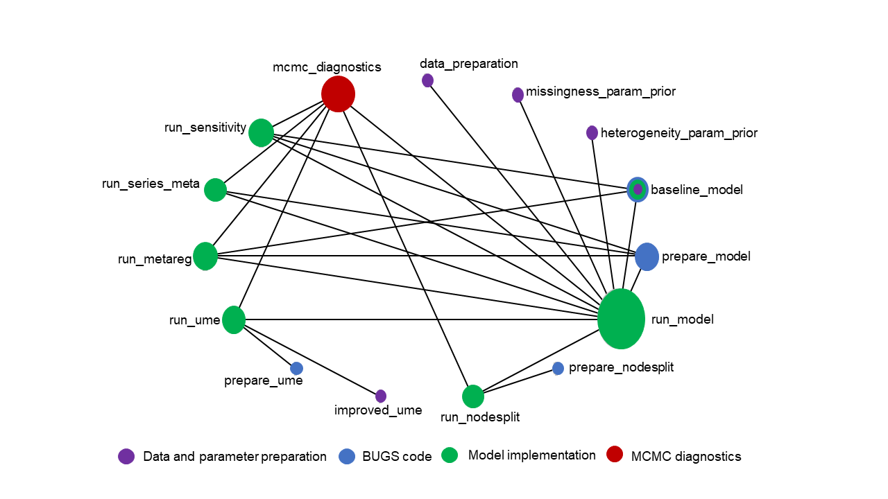
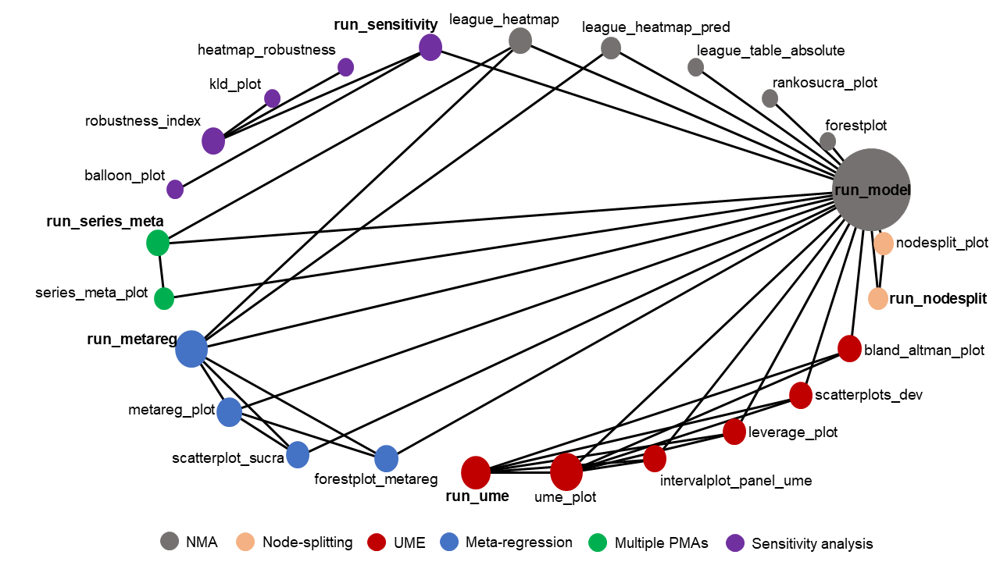

```{r setup, include=FALSE}
knitr::opts_chunk$set(echo = FALSE, warning = FALSE, message = FALSE)
options(tinytex.verbose = TRUE)
library(rnmamod)
library(dplyr)
library(kableExtra)
library(ggplot2)
```

# Introduction

Evidence-based medicine is the backbone of informed decisions for the benefit of 
the patients, stemming from a meticulous and judicious use of the available evidence, 
while taking into account also the clinical experience and patient values [@EvidenceBasedMedicine]. 
However, the medical community is faced daily with several intervention options and
dosages, challenging the optimal practice of evidence-based medicine [@Lee2022].
Systematic reviews with pairwise meta-analysis summarise the evidence of pairs of 
interventions, providing fragmented evidence that does not serve the clinical needs. 
Moreover, evidence in the comparability of different interventions at the trial 
level is also fragmented, as it is not feasible to compare all intervention options 
for a condition in one trial. These limitations led to the development and later 
establishment of network meta-analysis (NMA), also known as multiple treatment 
comparison, a new generation evidence synthesis tool [@Salanti2012]. Network 
meta-analysis is an extension of pairwise meta-analysis for collecting all relevant 
pieces of evidence for a specific condition, patient population, and intervention 
options to provide coherent evidence for all possible intervention comparisons, 
and allow ordering the investigated interventions from the best to worst option 
for a specific outcome [@Caldwell2014]. Indirect evidence (obtained from different
sets of trials sharing a common comparator) plays a central role in the development
and prominence of NMA. 

Since the introduction of indirect evidence and early development of the relevant
methodology [@Higgins1996; @Bucher1997], the NMA framework has undergone substantial
progress conceptually and methodologically. The fast-pace publications of relevant 
methodological articles and systematic reviews with multiple interventions attest 
to the increasing popularity of NMA in the wide medical and evidence synthesis 
community [@GetRealNMA; @Petropoulou2017]. Needless to say that the availability 
of statistical analysis software has been the driving force to the advances and 
wide dissemination of NMA. A review of the methodology and software for NMA 
[@GetRealNMA] listed several statistical software tools used to promote NMA, with 
the __R__ software [@R2023] being the most popular, followed by __Stata__ [@Stata] 
and __SAS software__ [@SAS2020]. In the last decade, there has been a rise in the 
R packages for NMA with various functionalities [@CRANTaskReview].

Most methodological studies on and systematic reviews with NMA have implemented
Bayesian methods [@GetRealNMA; @Petropoulou2017]. The advantages of the Bayesian 
framework (e.g., flexible modeling, allowance of uncertainty in all model parameters, 
incorporation of external relevant information and facilitation of probabilistic 
statements) [@Sutton2001], in conjunction with the dominance of the BUGS software 
[@Lunn2009] during the springtime of the NMA framework, may have contributed to 
the rising popularity of Bayesian NMA. The numerous R packages on Bayesian NMA 
also demonstrate the acclaim of Bayesian methods from the evidence synthesis 
community [@CRANTaskReview]. The rest of the section pertains to R packages on 
Bayesian NMA published in the __CRAN Task View 'Meta-Analysis'__ [@CRANTaskReview] 
that feature a wide methodological and reporting scope: \CRANpkg{bnma} [@bnma], \
CRANpkg{gemtc} [@gemtc], \CRANpkg{pcnetmeta} [@pcnetmeta], and \CRANpkg{rnmamod} 
[@rnmamod] (a recent novel contribution).

The R packages \CRANpkg{bnma} [@bnma], \CRANpkg{gemtc} [@gemtc], and \CRANpkg{pcnetmeta} 
[@pcnetmeta] conduct hierarchical NMA using Markov chain Monte Carlo (MCMC) methods 
through the __JAGS__ program [@Plummer2003]. However, they differ in their 
methodological and reporting breadth: \CRANpkg{bnma} [@bnma] 
and \CRANpkg{gemtc} [@gemtc] have a greater common basis on methods and outputs 
than \CRANpkg{pcnetmeta} [@pcnetmeta]. This may be ascribed to using the contrast-based 
modeling approach (trial-specific relative effects, such as log odds ratio, are 
pooled across the trials), which is the established approach to meta-analysis, whilst 
\CRANpkg{pcnetmeta} [@pcnetmeta] considers the arm-based modeling approach 
(arm-specific results, such as log odds, are pooled across the trials), which 
deviates from the standard meta-analysis practice [@Dias2016] and is less widespread. 

Currently, the \CRANpkg{pcnetmeta} [@pcnetmeta] package lacks functions for performing inconsistency evaluation 
and meta-regression. Also, it is limited to only rankograms in terms of hierarchy
measures [@Salanti2022], and considers solely trace plots as a visual diagnostic tool. 
On the contrary, \CRANpkg{bnma} [@bnma] and \CRANpkg{gemtc} [@gemtc] offer at least 
one method for inconsistency evaluation and meta-regression, and provide a wider variety of hierarchy measures
and diagnostic tools. All three R packages provide a compact toolkit 
of functions for presenting the relative treatment effects results: a league 
table for one outcome, typically displayed only in the console, and a forest-plot or table 
on the relative treatment effects of all comparisons versus a selected reference intervention.
Moreover, these packages provide most output using the `print()` function (the results appear in the 
console) than utilising visualisation. Consequently, the results are often presented in isolation, thereby limiting
the ability to gain further insights into the performance of the different NMA models 
(e.g, assuming consistency versus inconsistency). 

Given the complexity and the broad scope of NMA, researchers are faced with 
a substantial volume of results that are essential for understanding the evidence base. This involves
evaluating underlying assumptions and assessing the quality of the estimated parameters (via model 
diagnostics) to properly provide a response to the investigated research question. 
The aforementioned R packages have limited functionalities when it comes to presentation of NMA results.
As a result, meticulously examining and critically appraising the results, a necessary requirement to ensure the transparency
of conclusions delivered to the end users of systematic reviews including multiple interventions, presents a considerable challenge.
Furthermore, an overreliance on the R console limits the usability of the results. R users are required 
to resort to tabulation, which hampers comprehension, especially when analysing extensive intervention networks that inherently yield an immense amount 
of results. Alternatively, R users must write functions to produce the 
necessary visualisations, a time-consuming process that heavily relies on the user's programming skills in R.
The R  package __rnmamod__ [@rnmamod], recently published in the Comprehensive R Archive 
Network (available at 
[https://CRAN.R-project.org/package=rnmamod](https://CRAN.R-project.org/package=rnmamod)),
aspires to fill this technical gap by offering a rich, dynamic, user-friendly 
visualisation toolkit that transforms the inherently dense output of NMA into a collection of  
coherent graphs. Originally, the __rnmamod__ package was inspired by the absence of dedicated 
R packages that properly account for (aggregate) missing participants in the analyses 
underlying the NMA framework (e.g., core model, inconsistency assessment, and 
meta-regression). 

The article introduces the R package __rnmamod__ that performs Bayesian 
hierarchical NMA in JAGS through the R package \CRANpkg{R2jags} [@R2jags],
while modeling missing participants using one-stage pattern-mixture models [@Little1993].
The package's visualisation functionalities has been developed using the R package 
\CRANpkg{ggplot2} [@ggplot2] harnessing the flexibility it offers in creating 
and customising high-quality graphs. The rest of this article is structured as follows. Section 
[2](#Pattern-mixture-models-for-aggregate-binary-and-continuous-outcomes) provides 
an overview of the pattern-mixture models for aggregate binary and continuous 
outcome data within the context of NMA. Section [3](#The-architecture-of-\pkg{rnmamod}) outlines 
the architecture of __rnmamod__. In section [4](#X) we illustrate the various functions of the package on example datasets from published systematic reviews including NMA.
Finally, Section [5](#X) concludes with a discussion on the limitations and future 
developments of the package. 

# Pattern-mixture models for aggregate binary and continuous outcomes

We briefly introduce the pattern-mixture model, originally proposed by Little 
[@Little1993], and extend it to a summary binary and continuous outcome in the
evidence synthesis framework. The pattern-mixture model distinguishes the participants 
to those completing and those leaving the assigned intervention arm prematurely 
for several reasons. The former are called _completers_ and the latter 
_missing participants_. There is information only on the outcome of the completers 
for remaining to the assigned intervention until trial completion. If missing 
participants are not followed-up after leaving the trial, which is usually the case,
their outcome can only be hypothesised with some uncertainty; hence, we can determine 
a distribution of possible values to describe the hypothetical outcome of missing
participants in the assigned intervention. Ideally, this distribution should be elicited
using an expert opinion for the investigated outcome and interventions [@White2007]. 
Then, the weighted average of the observed and hypothesised outcomes, using the 
proportion of completers and missing participants as the corresponding weights, 
yields the _true_ outcome for all randomised participants receiving the investigated 
intervention. This corresponds to the intention-to-treat analysis, and it is of 
particular interest to investigate the impact of different scenarios about the 
missingness mechanism (implied by the distribution of hypothetical outcome 
values for the missing participants) to the treatment effect. This sensitivity 
analysis is at the core of the literature on handling missing data properly 
[@White2007; @Carpenter2007; @NationalResearchCouncil].

Consider a set of $N$ trials collected using a systematic review process. These 
trials investigate different sets of two or more carefully-selected interventions 
for a specific target population and clinical condition. We extract information on 
the number randomised, the number of completers and missing participants, and the 
measured outcome from each arm of every trial. The pattern-mixture framework models 
completers and missing participants simultaneously, maintaining the randomised
sample, as follows:

$$\begin{aligned}
\theta_{ik} = \theta^{c}_{ik} \times (1 - q_{ik}) + \theta^{m}_{ik} \times q_{ik}
\end{aligned}$$

where $\theta_{ik}$ is the true outcome in arm $k$ of trial $i$, $\theta^{c}_{ik}$
and $\theta^{m}_{ik}$ are the outcomes among the completers and missing participants,
respectively (the superscripts $c$ and $m$ stand for completers and missing), and 
$q_{ik}$ is the proportion of missing participants. It holds that 

$$\begin{aligned}
\theta_{ik} &= P(I_{ikj} = 1 | M_{ikj} = 1 \cup M_{ikj} = 0) \\
\theta^{c}_{ik} &= P(I_{ikj} = 1 | M_{ikj} = 0) \\
\theta^{m}_{ik} &= P(I_{ikj} = 1 | M_{ikj} = 1) \\
\end{aligned}$$

for a binary outcome, and 

$$\begin{aligned}
\theta_{ik} &= E(Y_{ikj} | M_{ikj} = 1 \cup M_{ikj} = 0) \\
\theta^{c}_{ik} &= E(Y_{ikj} | M_{ikj} = 0) \\
\theta^{m}_{ik} &= E(Y_{ikj} | M_{ikj} = 1) \\
\end{aligned}$$

for a continuous outcome, with $I_{ikj}$ and $M_{ikj}$ being dummy variables 
referring to whether a participant $j$ experienced the outcome or left the trial
prematurely, respectively, and $Y_{ikj}$ referring to the continuous outcome of 
participant $j$.

It has been suggested in the relevant published literature to replace the missingness 
parameter $\theta^{m}_{ik}$ with the following parameters to measure the informative 
missingness as a function of the outcome in completers and missing participants
[@White2008; @Mavridis2015; @Turner2015]:

$$\begin{aligned}
\phi_{ik} = logit(\theta^{m}_{ik}) - logit(\theta^{c}_{ik})
\end{aligned}$$

the informative missingness odds ratio in the logarithmic scale for binary outcomes,
and 

$$\begin{aligned}
\psi_{ik} = \theta^{m}_{ik} - \theta^{c}_{ik}
\end{aligned}$$

the informative missingness difference of means for continuous outcomes. Other
informative missingness parameters that have been suggested are X; however, IMOR and IMDoM XX. Both
informative missingness parameters take values in ${\rm I\!R}$ with zero implying
the missing at random assumption (ignorable missingness) and non-zero values 
indicating the missing not at random assumption (non-ignorable missingness). 
Essentially, the informative missingness parameters quantify departures from the 
missing at random assumption. Since these parameters are unknown, the analysts can
consider one of the following situations: 
- assign a fixed value, which corresponds to imputation [@Higgins2008; @Turner2015; @Spineli2019],
- assume a distribution with suggested parameter values [@White2008; @Mavridis2015], or 
- use the Bayesian framework to estimate their posterior distribution [@Turner2015; @Spineli2019]. 

Typically, a normal distribution is assigned on both informative missingness parameters 
[@Higgins2008; @White2008; @Mavridis2015; @Turner2015; @Spineli2019]. In the Bayesian 
framework, the analysts assign a prior normal distribution on these parameters and 
can determine the mean and variance of the normal distribution to be specific to the 
interventions, trials or trial-arms, fixed, exchangeable or independent across the 
interventions, trials, or trial-arms [@Turner2015; @Spineli2019]. 

# The architecture of \pkg{rnmamod}

## Functions on data preparation and model implementation

The `run_model()` function has a central role in the architecture of the __rnmamod__ 
package. It is the function of conducting the core NMA model and related analyses 
to assess the underlying assumptions of NMA. It also comprises the object of most 
functions to create the necessary visualisations. Initially, `run_model()` calls 
the `data_preparation()` function to prepare the dataset in the proper format to 
fit the model in JAGS. The dataset is provided in the one-study-per-row format, 
typical for codes written in the BUGS language. Then `run_model()` bundles the 
dataset and the necessary parameters (they have been processed through the 
`missingness_param_prior()`, `heterogeneity_param_prior()`, and `baseline_model()` 
functions) to conduct NMA through the `prepare_model()` function. The `prepare_model()` 
function contains the code in BUGS language to conduct a hierarchical one-stage 
NMA, as published by the NICE Decision Support Unit in a series of tutorial papers 
on evidence synthesis methods for decision-making [@Dias2013]. The `missingness_param_prior()` 
and `heterogeneity_param_prior()` functions process the hyperparameters of the 
selected prior distribution for the informative missingness parameter and the 
between-study heterogeneity parameter, respectively, to be read by JAGS. 
The `baseline_model()` function is relevant only in the case of a binary outcome. 
It processes the baseline risk defined by the user or the default option before 
conducting NMA. 

Subsequent analyses associated with the underlying assumptions of NMA are performed 
by specially devised functions that inherit most arguments from `run_model()`. 
Therefore, careful specification of the arguments in `run_model()` is essential 
for the contingent functions to yield sensible results and ensure meaningful 
comparison with the NMA results. These functions refer to the local and global 
consistency evaluation (`run_nodesplit()` and `run_ume()`), network meta-regression 
(`run_metareg()`), multiple pairwise meta-analyses (`run_series_meta()`) and 
sensitivity analysis to different missingness scenarios (`run_sensitivity()`) when 
the number of missing participants has been extracted for all study-arms. 
The functions `run_nodesplit()` and `run_ume()` call the `prepare_nodesplit()` and 
`prepare_ume()` functions, respectively, to fit the node-splitting and the unrelated 
mean effects models in JAGS. The function `improved_ume()` is also called to ensure 
a proper accommodation of the multi-arm trials in the unrelated mean effects model. 
In line with `run_model()`, network meta-regression, multiple pairwise meta-analyses, 
and sensitivity analysis are fitted in JAGS through the `prepare_model()` function. 
All model-related functions can be passed as an object to the `mcmc_diagnostics()` 
function to generate the diagnostic plots and measures for the monitored model 
parameters. 

Figure \@ref(fig:network-models) illustrates the network of the functions 
developed to prepare the data and conduct NMA and related analyses. Nodes and links 
refer to functions and the synergy of two functions. The node's  size indicates 
the usability of the corresponding function. For instance, `run_model()` is an 
over-represented node for having a dual role in the network: it is an object 
to most functions (e.g., `run_nodesplit()` and `mcmc_diagnostics()`) and depends 
on other functions to operate (e.g., `data_preparation()` and `prepare_model()`).
The node's colour indicates the operationality of the function: most functions 
perform model implementation (green nodes), followed by functions that contain 
the BUGS code (blue nodes) or process the dataset and prepare specific arguments 
(purple nodes) for the corresponding model. The `baseline_model()` function contains 
all three operationalities, whilst `mcmc_diagnostics()` offers only a set with 
MCMC diagnostics. 

```{r network-models, out.width = "100%", out.height = "30%", fig.cap = "Network of functions for data preparation and model implementation", fig.alt=""}

```

## The visualisation toolkit

Figure \@ref(fig:network-visualisation) presents the network of visualisation-related 
functions alongside `run_model()` and several model-related functions. The 
functions associated with summarising and presenting the results have a common 
structure: `run_model()` and the model-related function of interest are passed as 
objects into the corresponding arguments. Hence, `run_model()` comprises the backbone 
of the network and forms the largest node (Figure \@ref(fig:network-visualisation)). 
The visualisation-related functions are distinguished into the _stand-alone_ and 
the _platform_ functions. The stand-alone functions are immediately related to 
generating the relevant graphs. For instance, `forestplot_metareg()`, and `interval_panel_ume()` 
constitute stand-alone functions and return only the intended graph using `run_model()` 
together with `run_metareg()` and `run_ume()`, respectively, as objects in their 
arguments. Other stand-alone functions depend on a single function to operate; 
for example, `rankosucra_plot()` and `kld_plot()` use only the `run_model()` and 
`robustness_index()`, respectively, in their arguments. The platform functions 
host the stand-alone functions and generate complementary tables and further graphs. 
They are easy to spot in Figure \@ref(fig:network-visualisation), as they are named 
after the related model, with the *plot* affixed at the end: `nodesplit_plot()`, 
`ume_plot()`, `metareg_plot()`, and `series_meta_plot()`. For instance, 
`metareg_plot()` calls `scatterplot_sucra()` and `forestplot_sucra()` to return 
the corresponding intended graphs and prints tables in the console where the 
effect estimates and predictions from NMA are juxtaposed with those from network 
meta-regression. Every analysis has an individualised visualisation toolkit, 
indicated by the functions sharing the same colour node (Figure \@ref(fig:network-visualisation)). 
Only network meta-regression (blue nodes) and conducting separate pairwise 
meta-analyses (green nodes) share a few stand-alone functions with NMA (grey nodes), 
namely, `league_heatmap()` and `league_heatmap_pred()`.

```{r network-visualisation, out.width = "100%", out.height = "30%", fig.cap = "Network of functions for summarising and presenting the analysis results", fig.alt=""}

```

# A gallery of tooltips examples


# Summary

We have displayed various tooltips that are available in the package \pkg{ToOoOlTiPs}. 
